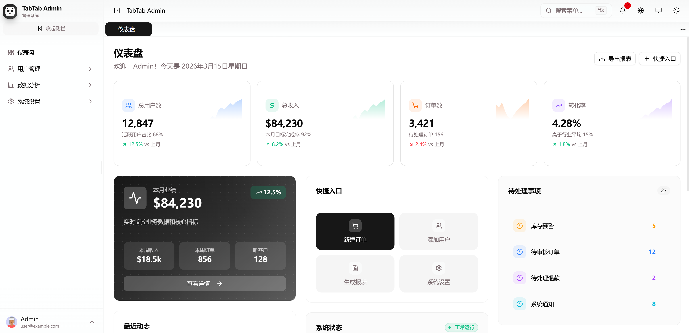
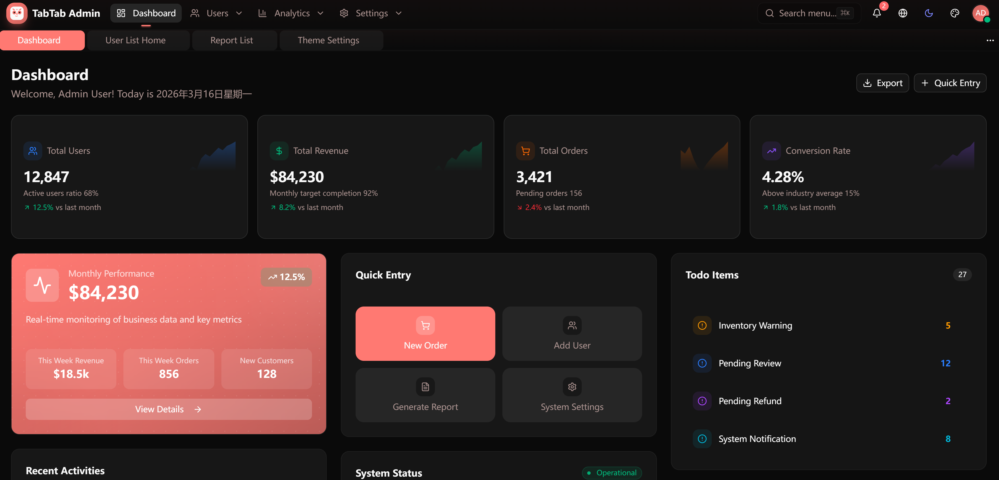
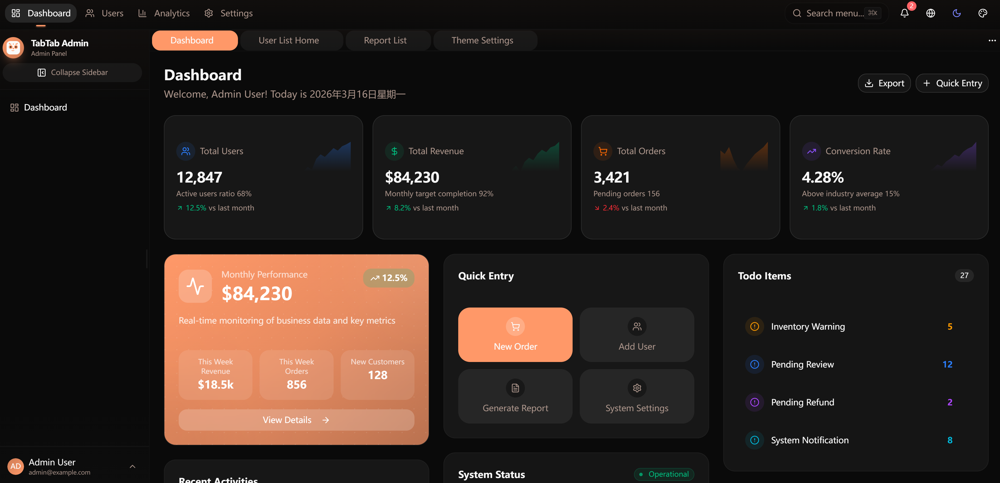
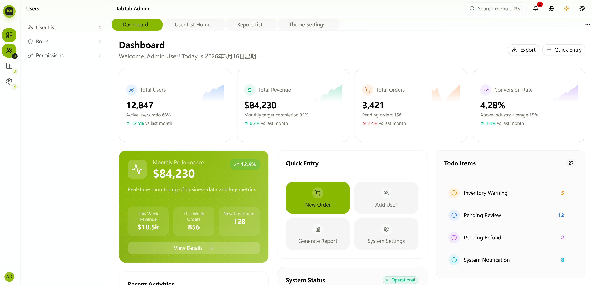
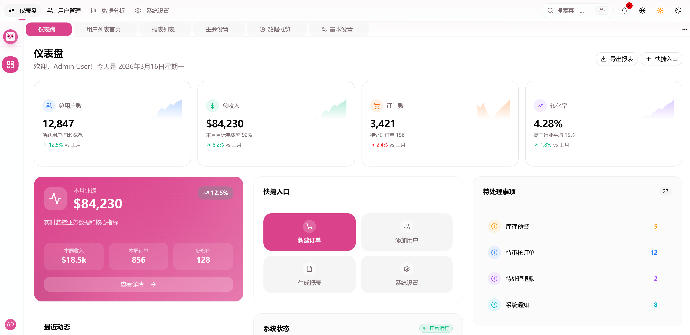

# TabTab UI

<p align="center">
  
  
  
  
  
</p>

<p align="center">
  Vue 3 + TypeScript + Vite Plus + Tailwind CSS v4 现代化组件库
</p>

---

## ✨ 预览

本项目包含一个管理应用：

### Admin - 后台管理系统

Admin 是一个功能完整的 Vue 3 后台管理系统模板，支持 **5 种布局模式** 实时切换：

<table>
  <tr>
    <td width="50%">
      
      <p align="center">侧边栏布局 (Sidebar)</p>
    </td>
    <td width="50%">
      
      <p align="center">双侧边栏布局 (Double Sidebar)</p>
    </td>
  </tr>
  <tr>
    <td width="50%">
      
      <p align="center">顶部导航布局 (Top Nav)</p>
    </td>
    <td width="50%">
      
      <p align="center">混合布局 (Mixed)</p>
    </td>
  </tr>
  <tr>
    <td width="50%">
      
      <p align="center">混合双栏布局 (Mixed Double)</p>
    </td>
  </tr>
</table>

| 布局模式           | 说明                                           |
| ------------------ | ---------------------------------------------- |
| **Sidebar**        | 经典侧边栏布局，适合菜单较多的后台系统         |
| **Double Sidebar** | 双栏侧边栏布局，适合菜单层级较深的系统         |
| **Top Nav**        | 顶部导航布局，适合菜单较少的轻量级系统         |
| **Mixed**          | 混合布局，顶部一级导航 + 侧边栏二级导航        |
| **Mixed Double**   | 混合双栏布局，顶部一级导航 + 双栏二级/三级导航 |

主要功能特性：

- 🔄 布局模式实时切换
- 🌓 明暗主题切换
- 🌐 中英文国际化
- 🏷️ 多标签页管理
- 🔍 全局页面搜索
- ⚙️ 完整的主题配置

---

## 🚀 技术栈

| 类别         | 技术                                                                                                   |
| ------------ | ------------------------------------------------------------------------------------------------------ |
| **核心框架** | [Vue 3](https://vuejs.org/) · [TypeScript](https://www.typescriptlang.org/)                            |
| **构建工具** | [Vite Plus](https://github.com/voidzero-dev/vite-plus) (Rolldown)                                      |
| **样式方案** | [Tailwind CSS v4](https://tailwindcss.com/)                                                            |
| **UI 组件**  | [shadcn-vue](https://www.shadcn-vue.com/) · [Reka UI](https://reka-ui.com/)                            |
| **状态管理** | [Pinia](https://pinia.vuejs.org/) · pinia-plugin-persistedstate                                        |
| **路由方案** | [Vue Router 4](https://router.vuejs.org/)                                                              |
| **国际化**   | [Vue I18n](https://vue-i18n.intlify.dev/)                                                              |
| **工具库**   | [VueUse](https://vueuse.org/)                                                                          |
| **Monorepo** | [pnpm Workspaces](https://pnpm.io/workspaces) · [Vite Plus](https://github.com/voidzero-dev/vite-plus) |

### 为什么选择 Vite Plus？

本项目采用 **Vite Plus** 作为构建工具，它是由 VoidZero 打造的下一代一体化 JavaScript 工具链：

- ⚡ **Rolldown 驱动** — 基于 Rust 编写的下一代打包器，接近原生速度，显著提升构建性能
- 🔧 **一体化工具链** — 整合 Vite、Vitest、Oxlint、Oxfmt、Rolldown、tsdown、Vite Task 于一身
- 🎯 **零配置体验** — 开箱即用，所有配置集中在 `vite.config.ts` 中
- 📦 **统一 CLI** — 统一的命令体验：`vp dev`、`vp build`、`vp test`、`vp check`、`vp fmt`、`vp run`
- 🗃️ **任务缓存** — Monorepo 任务缓存和依赖感知调度，加速团队开发流程
- 🔄 **平滑迁移** — 支持从现有项目轻松迁移到 Vite Plus

---

## 🎯 功能特性

### 布局系统

- **🎨 5 种布局模式** — 灵活适应不同业务场景
  - `sidebar` — 经典侧边栏布局
  - `double-sidebar` — 双栏侧边栏布局
  - `top-nav` — 顶部导航布局
  - `mixed` — 混合布局（顶部导航 + 侧边栏）
  - `mixed-double` — 混合双栏布局（顶部导航 + 双栏侧边栏）
- **🧭 智能导航** — 可折叠的响应式侧边栏菜单
- **🏷️ 标签栏管理** — 多标签页管理，支持页面缓存和快捷操作
- **🔍 全局搜索** — 快速导航到任意页面

### 主题系统

- **🌓 明暗主题** — 支持暗黑/明亮模式切换
- **🎨 主题定制** — 布局宽度、标签栏固定、侧边栏折叠等详细设置
- **✨ CSS 变量** — 基于 CSS 变量的灵活主题系统

### 其他特性

- **🌍 国际化支持** — 完整的中英文双语切换 (Vue I18n)
- **📱 响应式设计** — 完美适配桌面和移动设备
- **🔔 通知系统** — 基于 Toast 的消息通知

---

## 📁 项目结构

```
ui/
├── apps/                      # 应用目录
│   ├── admin/                # 后台管理系统
│   │   ├── src/
│   │   │   ├── components/  # 业务组件
│   │   │   ├── composables/ # 组合式函数
│   │   │   ├── config/      # 配置文件
│   │   │   ├── constants/   # 常量定义
│   │   │   ├── i18n/        # 国际化配置
│   │   │   ├── layouts/     # 布局组件
│   │   │   ├── router/      # 路由配置
│   │   │   ├── stores/      # Pinia 状态管理
│   │   │   ├── types/       # 类型定义
│   │   │   └── views/       # 页面视图
│   │   └── public/          # 静态资源
├── packages/                 # 包目录
│   ├── ui/                  # UI 组件库
│   │   └── src/components/  # 布局和 UI 组件
│   ├── styles/              # 样式包
│   ├── typescript-config/   # TypeScript 配置
│   └── utils/               # 工具函数
└── internal/                # 内部工具
    └── dev-cli/             # 开发 CLI 工具
```

---

## 🚦 快速开始

### 环境要求

- **Node.js**: `>= 20.0.0`
- **pnpm**: `>= 10.32.0`

### 安装 pnpm（如尚未安装）

```bash
npm install -g pnpm
```

### 安装依赖

```bash
pnpm install
```

### 启动开发服务器

```bash
# 启动所有应用
pnpm dev

# 单独启动 Admin
pnpm dev:admin
```

### 构建生产版本

```bash
pnpm build
```

### 预览生产构建

```bash
pnpm preview
```

### 类型检查

```bash
pnpm check
```

### 代码规范

```bash
pnpm lint
pnpm fmt
```

---

## 🧩 布局组件

项目提供了灵活的布局组件，位于 `@tabtab/ui` 包中：

### 使用示例

```vue
<script setup lang="ts">
import { Layout, LayoutHeader, LayoutContent, LayoutSidebarApp } from '@tabtab/ui'

// 布局模式：sidebar | double-sidebar | top-nav | mixed | mixed-double
const mode = ref('sidebar')
// 菜单配置
const menus = ref([
  { key: 'dashboard', title: '仪表盘', path: '/dashboard' },
  { key: 'users', title: '用户管理', path: '/users' },
])
</script>

<template>
  <Layout :mode="mode">
    <LayoutSidebarApp :menus="menus" />
    <LayoutContent>
      <LayoutHeader>
        <!-- 顶部内容 -->
      </LayoutHeader>
      <!-- 页面内容 -->
    </LayoutContent>
  </Layout>
</template>
```

### 布局模式说明

| 模式             | 描述           | 适用场景                         |
| ---------------- | -------------- | -------------------------------- |
| `sidebar`        | 经典侧边栏布局 | 菜单较多的后台系统               |
| `double-sidebar` | 双栏侧边栏布局 | 菜单层级较深的系统               |
| `top-nav`        | 顶部导航布局   | 菜单较少的轻量级系统             |
| `mixed`          | 混合布局       | 顶部一级导航 + 侧边栏二级导航    |
| `mixed-double`   | 混合双栏布局   | 顶部一级导航 + 双栏二级/三级导航 |

---

## 📦 包说明

### @tabtab/ui

UI 组件库，提供布局组件和基础 UI 组件：

- `Layout` — 布局根组件
- `LayoutHeader` — 顶部 header 组件
- `LayoutContent` — 内容区域组件
- `LayoutPage` — 页面容器组件
- `LayoutTabs` — 标签页组件
- `LayoutSidebarApp` — 侧边栏组件
- `DoubleSidebar` — 双栏侧边栏组件
- `Breadcrumb` — 面包屑组件
- 等...

### @tabtab/styles

全局样式包，提供 CSS 变量和全局样式。

### @tabtab/utils

工具函数包，提供常用的 CSS 和组件工具函数。

---

## 🔌 应用说明

### Admin 应用

基于 `@tabtab/ui` 构建的完整后台管理系统，包含：

- 5 种布局模式实时切换
- 完整的主题系统配置
- 国际化支持（中英文）
- 标签页管理
- 用户认证模拟
- 通知系统

---

## 📄 许可证

[MIT](LICENSE) © TabTab UI
